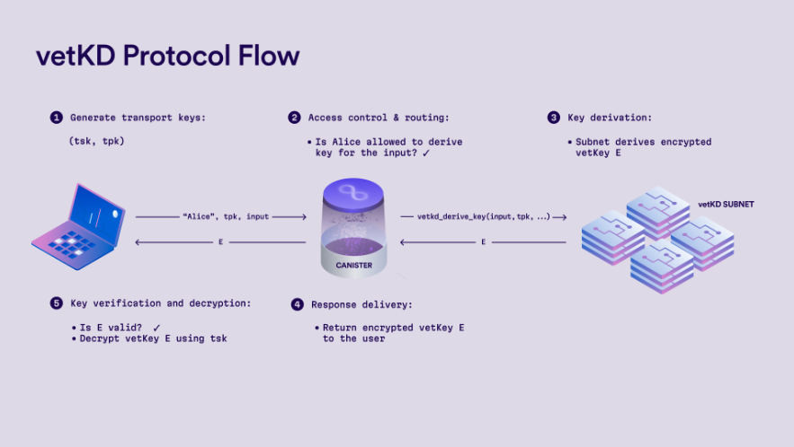

# vetKD API
Distrubuted protocol for securely deriving cryptographic keys, referred to as **VetKeys**

Canisters can request VetKeys using this protocol (API)

Key derivation is deterministic - same inputs will produce the same keys. Thus canisters can retrieve keys reliably. 

### Methods of the API: 
1. ``vetkd_derive_key``: derive keys based on provided inputs 
2. ``vetkd_public_key``: a public key that can be used to verify keys derived using ``vetkd_derive_key``

Check out the full API specification [here](https://internetcomputer.org/docs/references/ic-interface-spec#ic-vetkd_public_key)

## Available master keys:
- ``key_1``: production key availabe on mainnet. (resides on subnet [pzp6e](https://dashboard.internetcomputer.org/network/subnets/pzp6e-ekpqk-3c5x7-2h6so-njoeq-mt45d-h3h6c-q3mxf-vpeq5-fk5o7-yae) and backed up on [uzr34](https://dashboard.internetcomputer.org/network/subnets/uzr34-akd3s-xrdag-3ql62-ocgoh-ld2ao-tamcv-54e7j-krwgb-2gm4z-oqe)).

- ``test_key_1``: test key available on mainnet too

- ``dfx_test_key``: only available on local development environment started by ``dfx``

Any canister can use the master key, regardless of whichever subnet their canister key resides in. Since the management canister automatically redirects the calls to the subnet where the master key resides. 

## Obtaining a vetKey:
Involves both backend & frontend - since transport key is also provided by the user 

## Logical flow: 

Step 1: Implement the canister endpoints 

Step 2: Generate a transport key pair and pass they transport public key to the canister (from the frontend)

Step 3: Retrieve the vetKD public key from the backend canister

See more [here](https://internetcomputer.org/docs/building-apps/network-features/vetkeys/api#step-1-implement-canister-endpoints)

## API fees:
1. Production key (key_1):	26_153_846_153 Cycles -> $0.0354325     
2. Test key (test_key_1):  10_000_000_000 Cycles ->  $0.0135482

## Offline Key Derivation: 
You can perform an offline key derivation to avoid network costs 

Check out more [here](https://internetcomputer.org/docs/building-apps/network-features/vetkeys/api#offline-key-derivation)
