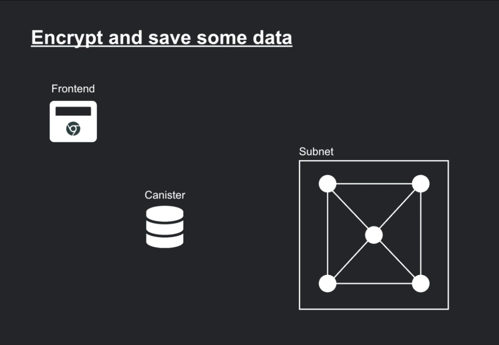
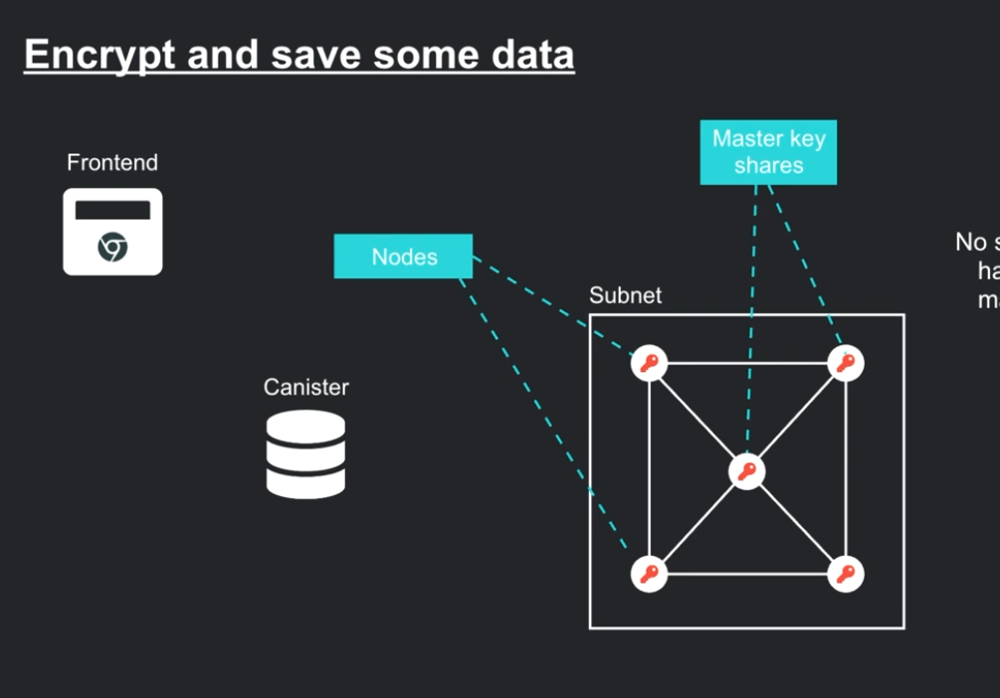

## Kristofer's video: 
Challange: we want to encyrpt sensistive information on the blockchain
IBE: Identity Based Encryption

Parties Involved:

Each node on the subnet gets a share of the master key - no single node has access to the full key, and they can't derive. 

Subnet node can jointly derive new keys from the master key - by threshold signing procedure. 

[Youtube Link](https://youtu.be/144Q4DRZ3KY?si=phgIm5fyfJSUAtAF)