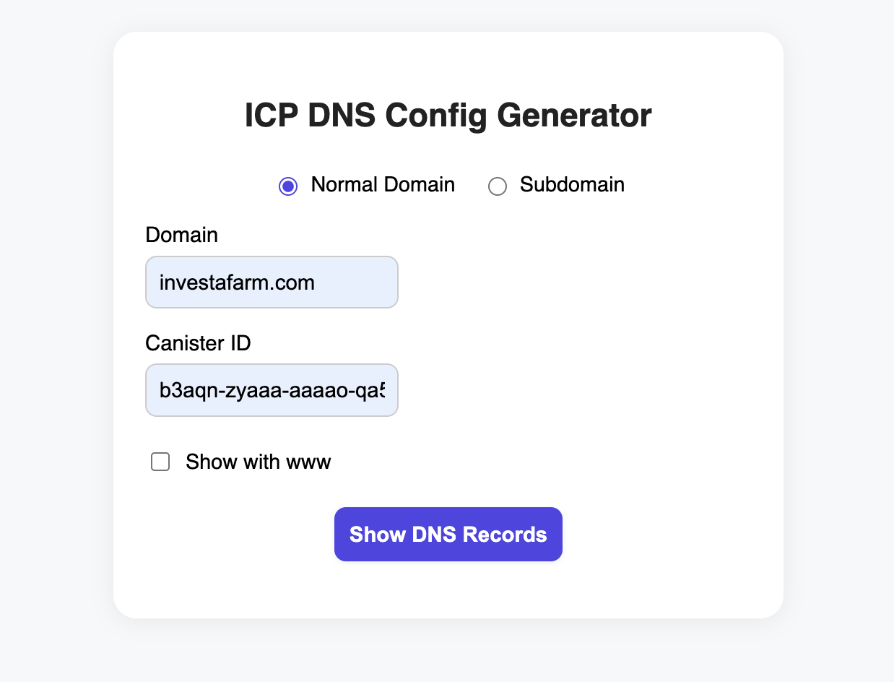
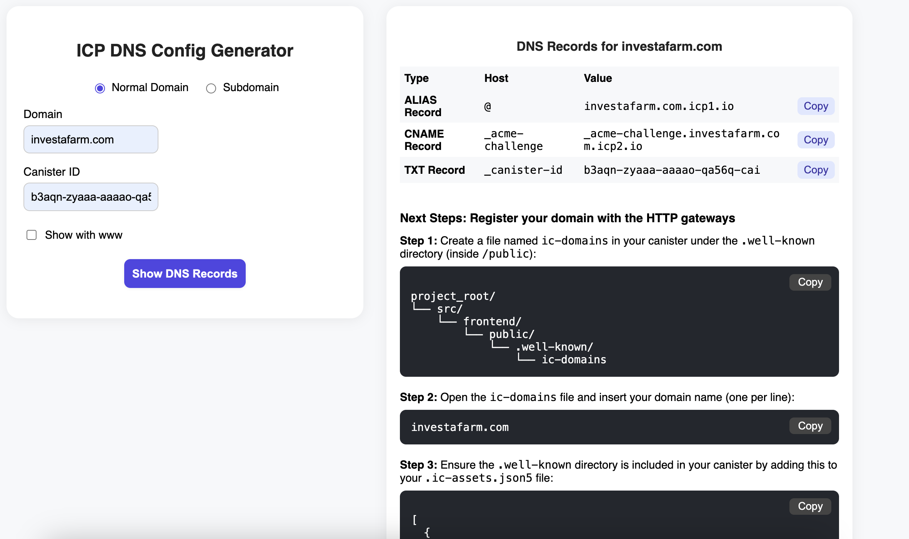
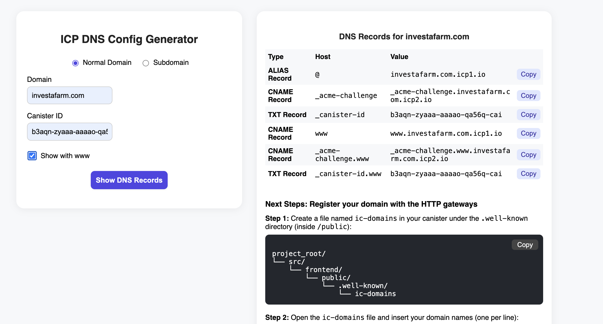
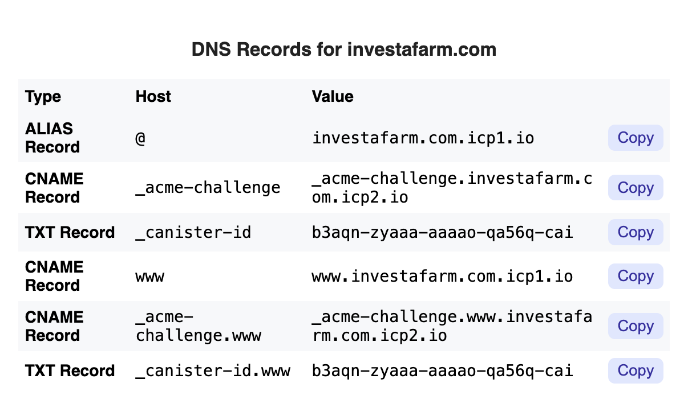
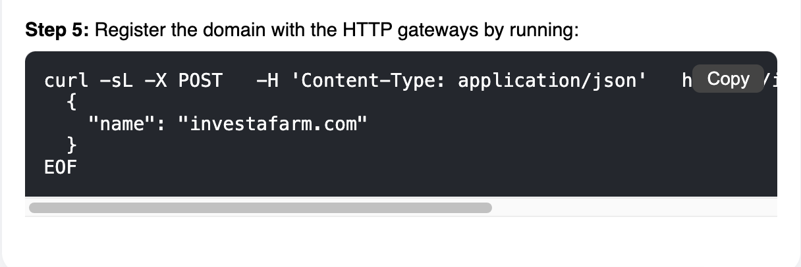
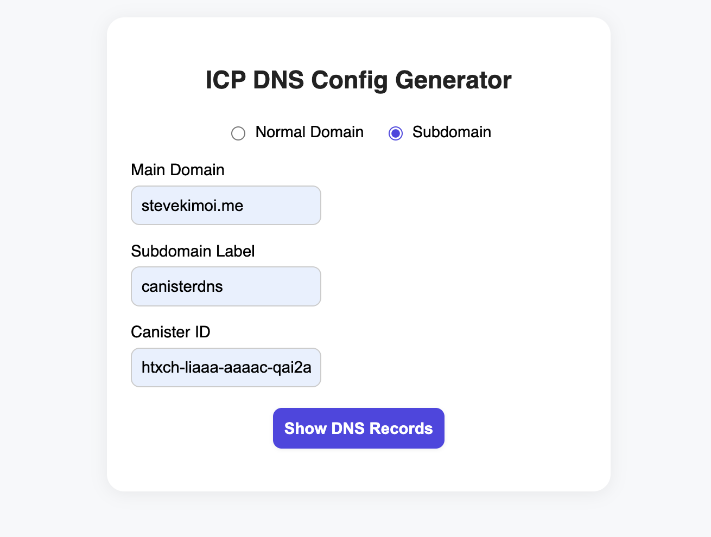
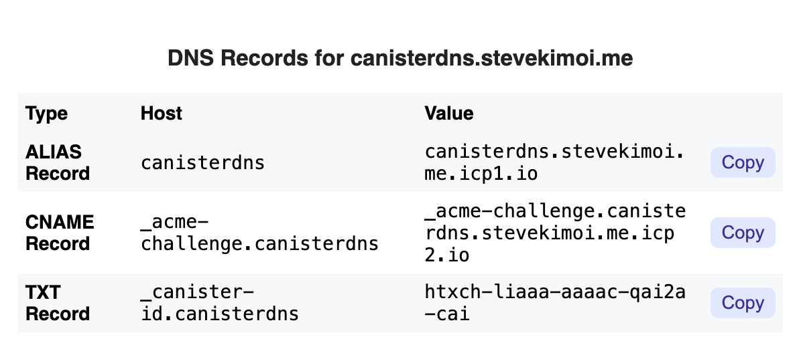
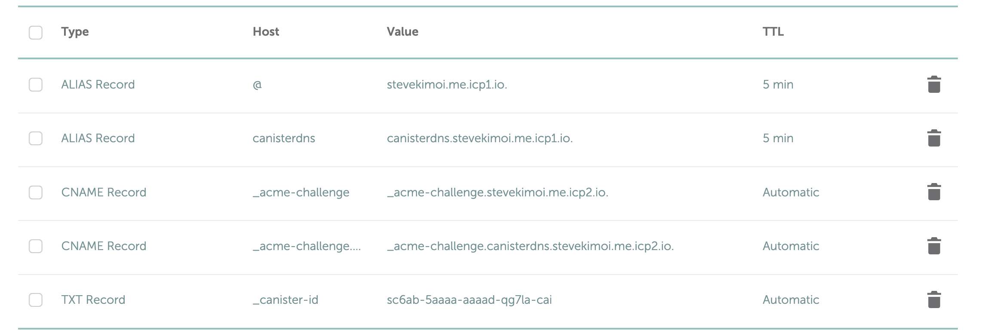

# Canister DNS

A tool to easily connect your custom domain to your canister URL, supporting both main domains and subdomains.

## Quick Start

Visit [canisterdns.stevekimoi.me](https://canisterdns.stevekimoi.me/) to get started.

## Domain Configuration

### 1. Generate DNS Records

1. Enter your domain and canister ID
   

2. Click "Show DNS Records" to view your DNS configuration
   

3. For www subdomain support, toggle "Show with www"
   

### 2. Configure DNS Provider

1. Copy the generated DNS records
   

2. Add these records to your DNS provider (e.g., Namecheap)
   

### 3. Configure Canister

1. Create `.well-known/ic-domains` file in your canister's public directory
   

2. Add your domain(s) to the file (one per line)
   

3. Update `.ic-assets.json5` to include the `.well-known` directory
   

4. Deploy your updated canister
   

### 4. Register with HTTPS Gateway

Run the provided curl command to register your domain

## Subdomain Configuration

### 1. Generate Subdomain DNS Records

1. Click the subdomain button
2. Enter:
   - **Domain**: Your main domain (e.g., `stevekimoi.me`)
   - **Subdomain label**: The subdomain prefix (e.g., `canisterdns`)
   - **Canister ID**: Your frontend canister ID
   

3. Click "Show DNS Records"
   

### 2. Configure DNS Provider

Add the generated records to your DNS provider

### 3. Configure Canister

1. Create `.well-known/ic-domains` file
   

2. Add your subdomain to the file
   

3. Update `.ic-assets.json5` to include `.well-known` directory
   

4. Deploy your updated canister
   

### 4. Register with HTTPS Gateway

Run the provided curl command to register your subdomain

--- 

Check the source code [here](https://github.com/Stephen-Kimoi/canister-dns)

Check the official documentation [here](https://internetcomputer.org/docs/building-apps/frontends/custom-domains/using-custom-domains/)